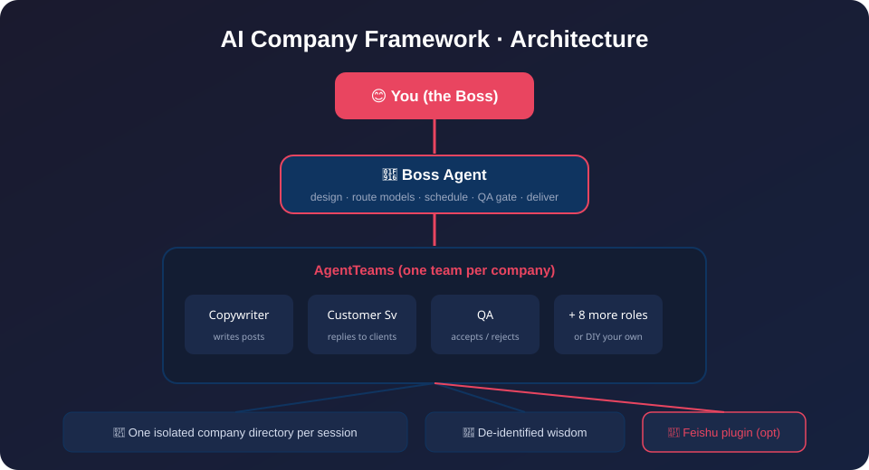
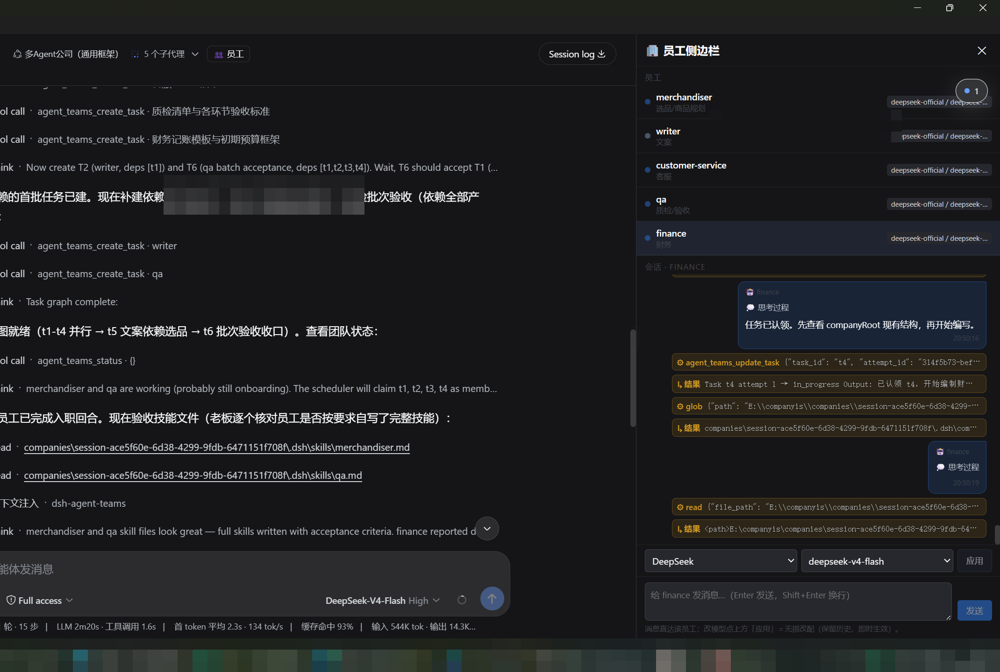
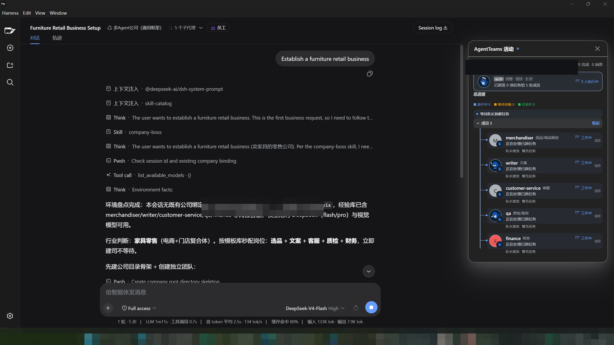
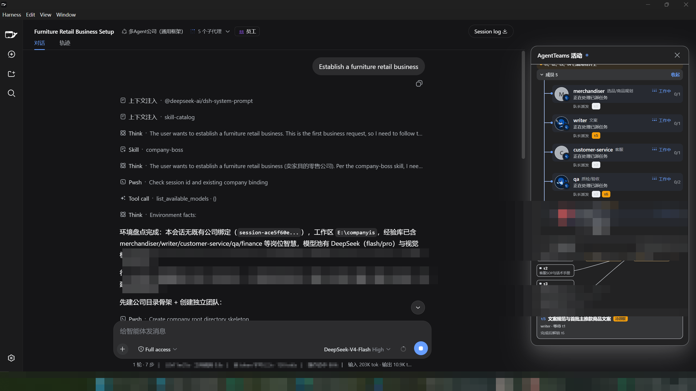

# AI Company Framework · 一句话开一家 AI 公司

> ## 🪄 公司，一个词而已（Company Is a Word）
>
> 🚀 **小白 5 分钟拥有自己的 AI 公司**：新建一个会话，说一句
> 「我要开一家卖精品咖啡豆的电商公司」，
> 框架自动帮你建团队、配岗位、派活、质检、交付——你只负责拍板。

[](LICENSE)
[](CONTRIBUTING.md)
[](RELEASE_NOTES.md)

[English](README.md) | [简体中文](README.zh-CN.md)

---



## 真实运行截图

### 一句话 → 一家开始运转的 AI 公司



### AgentTeams 员工活动与任务依赖图



### 打开任意员工：查看工作、直接发消息或更换模型



---

## ✨ 五大卖点

### 1️⃣ 部署超轻松——它是 DeepSeek Harness 的框架

- **无需服务器、无需数据库、无需 API Key 配置**
- 只要装了 [DeepSeek Harness](https://github.com/deepseek-ai)（Windows 桌面版，登录即自带模型）
- 跑一条安装脚本，3 步开公司
- 没有技术背景也能装——`install.ps1` 一键完成

### 2️⃣ 小白快速拥有自己的 AI 公司

- 一句话（如「我要开一家卖精品咖啡豆的电商公司」）→ 自动建司
- 老板最多问你 **1–2 个关键问题**（价位、渠道），其余按行业默认值先干
- 岗位自动配、模型自动选、团队自动建、首单自动派
- 全程看结果，不用学任何 Agent 概念

### 3️⃣ 你的员工，你说了算——可以自己调教子 Agent

- 👥 **查看员工对话**：会话头部 👥 按钮打开员工侧边栏，随时看每个子 Agent 在干什么
- 🎛️ **无损改配模型**：员工干得不顺？侧边栏直接换更强的模型路由，不动会话、不丢上下文
- 📨 **直接发消息指挥**：像给同事发微信一样给员工单独布置任务、纠偏
- 🧠 **员工会进化**：每个员工入职自写技能文件，工作中持续维护——你的调教会被记住，越用越顺手

### 4️⃣ 扩展性拉满——DIY 各种各样的公司

- **11 个预置岗位**：文案、客服、质检、调研、剪辑、财务、人事、运营、开发、数据分析、翻译
- **行业模板库**：电商 / 短视频 / 游戏 / 咨询 / 客服外包…一句话自动套岗位
- **没有的岗位自己造**：按 `company-role-template` 写一个岗位骨架，员工入职自动补全技能
- **插件体系**：贡献新能力只需一份 `manifest.json` + 一个技能文件（见 `docs/PLUGINS.md`）
- 想开咖啡公司、家具公司、游戏工作室、咨询公司——换一句话就行

### 5️⃣ 公司想开多少家开多少家

- **一个会话 = 一家公司**，数据彻底隔离，绝不串
- 想开第二家？**新建一个会话再说一句话**，立刻又是一家全新公司
- 每家公司有自己的团队、员工、文件目录、飞书机器人
- 同时经营咖啡电商 + 家具电商 + 短视频工作室——互不干扰，各干各的

---

## 快速开始（3 步）

### 前置条件

- Windows 10/11
- [DeepSeek Harness](https://github.com/deepseek-ai)（桌面版）已安装并登录

### 第 1 步：把框架装进 Harness

```powershell
# 进入仓库目录
cd ai-company-framework
# 一键安装（把 core/skills 复制到 Harness 技能目录）
.\scripts\install.ps1
# 自检环境
.\scripts\verify.ps1
```

### 第 2 步：新建一个会话

在 Harness 里 **新建会话**（不要复用旧会话——一个会话只能开一家公司，新会话 = 新公司）。

### 第 3 步：说一句话

> 「我要开一家卖精品咖啡豆的电商公司，首单产出一篇小红书种草笔记和客服话术包。」

老板会最多问你 1–2 个关键问题（价位、渠道），然后自动完成剩下所有事。

## 它能做什么？

| 能力 | 说明 |
|------|------|
| 🏢 一键建司 | 一句话推断行业 → 秒配岗位/路由/团队/目录 |
| 👥 多 Agent 员工 | 11 个预置岗位，可 DIY 新岗位，可调教 |
| 🚦 自动调度 | 依赖图建任务，并行执行，事件驱动不空转 |
| ✅ 质检闭环 | 员工交付 → 质检把关 → 打回点名 → 返工复检 → 放行 |
| 📦 交付打包 | 交付清单 + 假设清单 + 验收点，分批交用户 |
| 🧠 经验沉淀 | 跨公司共享去敏工作智慧，业务零污染 |
| 🔒 会话隔离 | 一个会话 = 一家公司，想开几家开几家 |
| 📱 飞书插件 | 可选安装，手机遥控公司 / 客服直连客户 |

## 目录结构

```text
ai-company-framework/
├─ core/                      # 框架本体
│  ├─ skills/                 # 老板总控 + 流水线 + 11 个岗位技能
│  ├─ templates/              # 任务/质检/交付/返工模板
│  └─ feishu-onboarding-sop.md
├─ plugins/                   # 可选插件（飞书等）
│  └─ feishu/
├─ scripts/                   # 安装/自检/安全扫描
├─ docs/                      # 小白文档 + 插件开发指南
├─ examples/                  # 示例公司
├─ tests/                     # 冒烟测试
└─ LICENSE (MIT)
```

## 插件体系（给开发者的接口）

框架从设计上就是可插拔的。插件 = 一个目录 + 一份 `manifest.json`：

- **挂载点**：建司后、入职前、任务前、质检后、交付前…
- **技能注入**：插件可贡献岗位技能（如飞书客服）
- **脚本钩子**：`hooks` 支持自定义 PowerShell/Node 脚本
- **隔离约束**：插件不得读其他公司数据，凭据必须加密

写插件请看 [`docs/PLUGINS.md`](docs/PLUGINS.md)。飞书插件示例见 [`plugins/feishu/`](plugins/feishu/README.md)。

## 文档

- [快速开始（详细版）](docs/QUICKSTART.md)
- [架构说明](docs/ARCHITECTURE.md)
- [插件开发指南](docs/PLUGINS.md)
- [常见问题 FAQ](docs/FAQ.md)
- [故障排查](docs/TROUBLESHOOTING.md)

## 贡献

欢迎任何形式的贡献——问题、想法、插件、文档、PR。
请先读 [CONTRIBUTING.md](CONTRIBUTING.md) 与 [CODE_OF_CONDUCT.md](CODE_OF_CONDUCT.md)。

## 路线图

- [x] v0.1 核心：建司 + 调度 + 质检 + 交付
- [x] 11 个预置岗位技能
- [x] 飞书桥接入（P2P 验证通过；0.4.0 多岗位路由 staging）
- [ ] v0.2 插件市场雏形 + 更多示例公司
- [ ] v0.3 小白向导 UI + 一键体验

## 许可证

[MIT](LICENSE) © 2026 AI Company Framework contributors

## 免责声明

- 本框架生成的内容（文案/方案/代码）需人工把关后使用，不构成专业建议。
- 飞书 0.4.0 多岗位虚拟路由为 staging，生产部署前请自行评估。
- 群机器人入群与镜像 webhook 需在飞书客户端手动操作。
